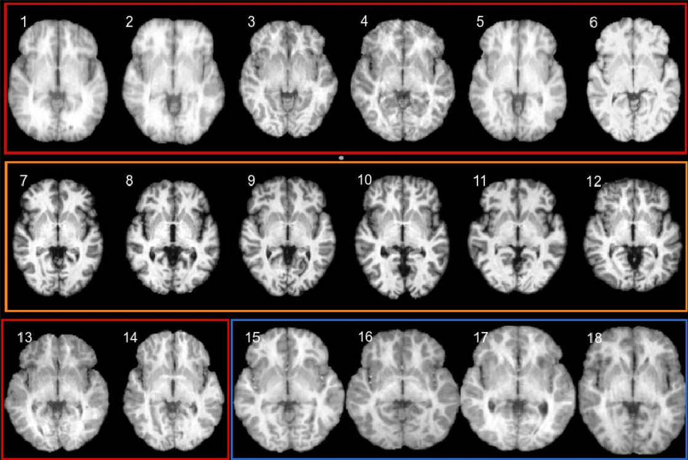

# Brain Segmentation Challenge
This repository contrains source code and the report for the Brain Segmentation challenge. It was the final assignment for the **Medical Image Segmentation and Analysis** course at the University of Girona for the [MAIA programme](https://maiamaster.udg.edu/).

||
| :--: | 
| *Images from the IBSR18 dataset grouped by resolution* |

**Proposed solution reached average dice of 0.937 for the best U-Net model, while also reaching an average dice of 0.828 with just SynthSeg segmentations and  an average dice of 0.778 for the best multi-atlas combination strategy.**

[Link to the report](MISA_Final_Project.pdf)
___
## Authors
Alejandro Cortina Uribe [github](https://github.com/alexCortinaU) | [linkedin](https://www.linkedin.com/in/acortinau/)

Vladyslav Zalevskyi [github](https://github.com/Vivikar) | [linkedin](https://www.linkedin.com/in/vlad-zalevskyi/)
___
## Challenge description

>In this final project, we explored and implemented several available approaches for brain segmentation. **Our goal was to produce segmentation maps with WM, GM, and CSF labels** from the given set of images from **the IBSR18 dataset**. The segmentation problem we were tackling in this challenge is **unbalanced**, since the minority class CSF occupied less than 2% of total GT segmentation volumes (in part due to the way GT were created). We implemented and test various algorithms to assess their benefits, limitations, and performance on our dataset. As a baseline approach, we implemented a **multi-atlas algorithm with majority and weighted voting combination strategies**. Then, we used the deep learning model **SynthSeg to directly obtain segmentations** and evaluate them, without any fine-tuning of the model. Finally, we developed our own deep learning model using a **2D U-Net architecture trained with image patches**, testing its performance when a single or two channels (anatomical prior) are used for the input.
___

## Repository structure

* `notebooks/` - contains the notebooks used for the project

    * Please refer to [PreprocessRegisterData](notebooks/0_PreprocessRegisterData.ipynb) notebook to see details of the pre-preprocessing and registration steps performed before multi-atlas segmentation.

    * And to [MultiAtlasSegmentation](notebooks/1_MultiAtlasSegmentation.ipynb) notebook to see the implementation of the multi-atlas segmentation algorithm with different weights.

 * `datasets/` - contains the dataset class and utils used to load and preprocess the data
    * [patch_dataset.py](datasets/patch_dataset.py) - contains the dataset class used to load and preprocess the data based in Pytorch Dataset and LightningDataModule classes.

* `models/` - contains the source code for the models
    * [UNetModel.py](models/UNetModel.py) - contains the source code for the 2D U-Net model written based on the Lightning class.

*  `train.py` - main script used to train the models

* `brain_segmenter.py` - contains the source code for the brain segmenter class that allows direct segmentation of the images using the trained models (deals with patch slicing and reconstruction as well as the model inference and simple ensembling)

* `config.py` - contains the configuration parameters for the project (paths, hyperparameters, etc.)